# grrcon-2026

My notes and observations from GrrCON 2026.

_These are my personal notes about my personal experience. These are not professional notes nor a full review of the conference. These are my personal opinions and should you be offended then that is on you. As the program clearly states: "Attend at your own risk of being offended, but also don't be a jerk."_

## tl;dr

What an amazing conference! Honestly I don't think there were any real missed or bad sessions this year. From the opening keynote to the final session I attended I think I learned, or had a prior though reinforced, a ton this year. Even better though was connecting with vendors and friends on a different level now that I have a role in running the #misec organization (a 501c3 nonprofit in Michigan). I was also able to chat with a few vendors regarding my professional role and what other services might help out. I'm looking forward to a followup with Cloudflare on that. I think the highlight was the Grand Rapids #misec Meet Up at The Bob on Thursday evening. I cannot tell you how many people were there for our meetup but I can tell you that many had expensive tastes (Knob Creek and Woodford Reserve and Ketel One?!?!?!).

## Wednesday

Wednesday evening I always try and hang around downtown for a quiet drink or three with some close friends that travel in for GrrCON. Unfortunately my usual place (Twisted Tap) is no longer open on Wednesday's and I totally forgot! Instead I stopped in at Cinco De Mayo for some tacos... which was not the best choice of the evening. I don't know what happened there but the service was very poor and the tacos were just so bland. I just expected more.

After tacos I pivoted to the unofficial GrrCON hangout: Z's Bar and Restaurant! Z's is always a good time on its own but being full of friends and soon to be friends made it extra special. I especially enjoyed talking to some presenters (Patrick and Tom and John and others) and reconnecting with friends that I only see but once a year. Ed and his 3D printer went all out and it was fun getting a preview.

My #misec President joined me on a trek _o'er the river and through the woods_ to meet with one of our #misec Elders, Brian, for a meet and greet with some sales people at the Drop Drop. Now THAT is a cocktail lounge and what a wonderful old fashioned it was. Of course the trek back to my car was long. I got my steps in!

I had to stop at Meijer for last minute #misec supplies and then I went to bed! Thursday would come soon enough.

## Thursday

Thursday is by far the longest day of the conference for me. I was downtown from 8am until nearly midnight.

### Sessions

_Just a small heads up: I do try and attend every session of interest. However sometimes socializing and hitting up the vendors is more important at the time. This is why I wish GrrCON would record their sessions. I might make a proposal for this._

| Session | Presenter | Grade (Good, Meh, Bad) |
|---------|-----------|------------------------|
| Keynote: GrrCON Awakening: How Humans Win | George Kamide, Dr. Louis DeWeaver, and Dr. Chase Cunningham | Good   |
| This Talk Was Written by AI | Dave Kennedy | Good |
| Your Security Isn't Failing, It's Regressing | Timothy Scheid | Meh |
| So You Want To Be a Forensicator | Catherine Ullman | Good |
| My Bed Tried To Freeze Me at 3AM. I Rooted it. | Adam Schaal | Good |
| What Happens to Cybersecurity When The Internet Fails | Dick Haight | Good |

#### Session Notes (Kind of raw and messy, be warned)

1. Keynote: GrrCON Awakening: How Humans Win
    - This was one of the best opening keynotes that I've heard in a while.
    - In classic GrrCON fashion it was full of expletives and real human thought and opinion.
    - Build community > corporate world/life. We are humans and we deserve to be around other humans and treated with respect.
    - Don't compromise on your values.
    - Listen. Support. Share the love.
    - Remember that the person next to you could be your future boss. Be kind to each other.
    - This was the phrase of the year: "Self licking ice cream cone of misery."
    - Cyber insurance: Go F### yourself. (to be clear I only agree in the professional sense that insurance should be way more proactive and they need to stop being jerks when an incident happens.)
    - On insurance: Especially F### the "War Clause" and terrorist clauses that always appear.
        - Seriously. On a personal note I get the _why_ but this just reduces humans to units. 
    - On insurance: The business model goal of trying to not pay is evil.
    - Rather have a blind proctologist rather than go get another certification.
        - I do not disagree here. Certs can be good if they enrich you personally _and_ professionally. 
    - "Give me a Google cert!" While this certainly got a chuckle it speaks to a real truth: I don't need someone with a certification - I need someone who knows how to find the answer when it counts. Whether they know it by memory or they can find it on a wiki. 
    - Certs == scam money grab for a captive industry.
    - Which is it? Unfilled jobs are numerous, so are the people looking for work, and yet corps are not hiring. This is pure marketing and these companies are not serious. 
    - VC rule of 40: 40% Year over Year. ----> PE Firm Logic.
    - Too much of this thought: The Return Must Be Greater Than "Is it good for Humans and Society?" 
        - I think it is clear that the people in this keynote are commenting on a lot more than just AI and society. I echo many of these thoughts. I do think that a business should not exist solely to make a greater return of money; it should also exist to benefit the human society that allows it to exist.
    - We have a fundamental right to operate in a safe place.
    - We don't have actual real "AI" right now. We have both real and natural stupidity at times. 
    - To the vendors and services people: The Enterprise market is picked clean! Focus on SMB and mom/pop shops. They need help!! 
        - This one speaks to me. The services I offer are not tailored to the enterprise. Can they work there? Yep! I'll gladly take enterprise budget. However I work with smaller orgs for a reason: They can't afford the enterprise prices. 
    - Do not purchase based solely on analyst (cough GARTNER) reports. These are pay-to-play.
    - Scarcity -> Specialization. The story of human society.
    - There exists a ceiling to thinking.
        - That one is a bit fuzzy in my notes and memory.

Overall a very excellent opening keynote and much better than last year.

2. This Talk Was Written by AI
    - Another excellent morning talk. Dave Kennedy does a good job getting his points across. Overall I think the message I left with is that this isn't going away, we need to lean in, learn and don't just complain, and just build stuff!
    - Fun is back. Feels like the magic of the 90s again.
    - Products give visibility; you still need humans to look and see and manage.
    - Dave made the original (and still develops) the Social Engineering Toolkit (SET).
    - Hype or Revolution? It's both. Advantage goes to those that test claims and ship good systems.
    - Trust is earned, not given. Apply this to humans and AI.
    - AI Leaders are NOT security minded folks.
    - Check out the book: Build a Large Language Model.
    - JEB -> Fast classifier. 
    - Start small and ship something.
    - Nightwire: github/hackingdave/nightwire
    - NightBeacon
    - AI simplifies complexity.
        - This is so true! I cannot keep my codebase in my head and know all the functions. AI can and this is the biggest win for me.
    - Context beats clever prompts.
    - Magic Unicorn V2 coming soon.
        - I believe this is one of his projects.
    - AI Drafts -> Analyst human owns final call.
    - AI needs hard controls and rails. 
    - NPM delay 3 days + disable scripts == stop supply chain.

3. Your Security Isn't Failing, It's Regressing
    - I only gave this a 'meh' rating because it could be summed up in two words: Change Management. 
    - With that said I have to give props to Timothy: He did a great job presenting and it was HIS FIRST TIME SPEAKING! Great job at putting yourself out there Timothy. Keep it up!! 
    - Regression: Controls fail silently over time due to changes.
        - Read: Undocumented and non-communicated changes are bad! 
    - TODO: Link a photo of a slide.
    - Failure is in the systems around controls.
    - Decay, Drift, Detachment.
    - Quick Definitions Slide
        - 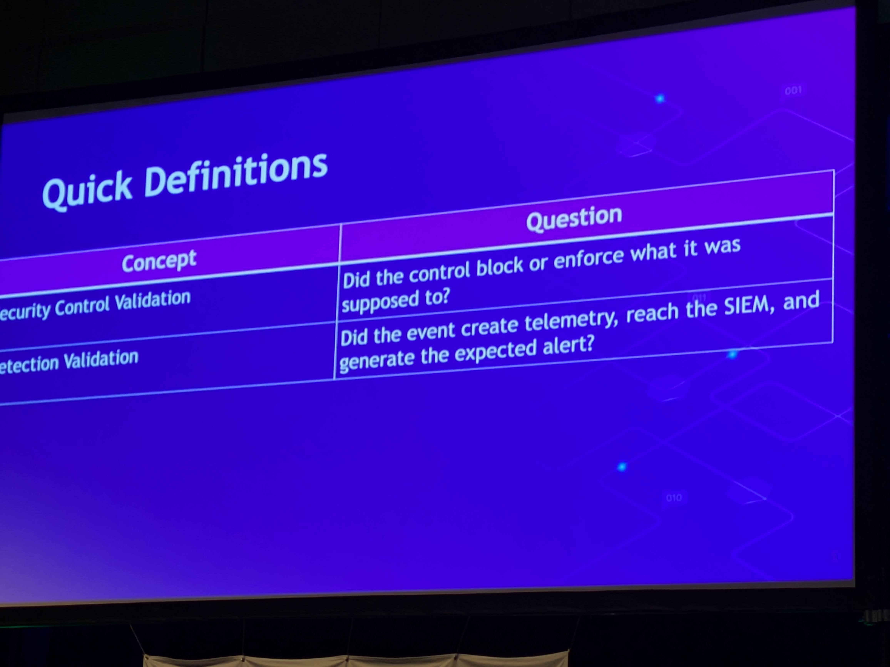
    - Regression Failure Model (took a photo to link).
        - 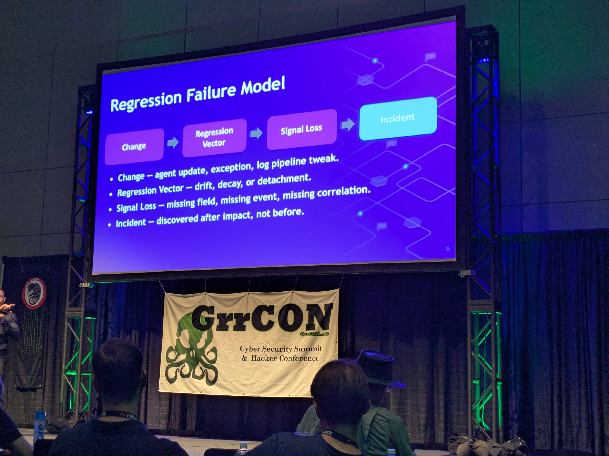
    - Least Common Denominator slide
        - 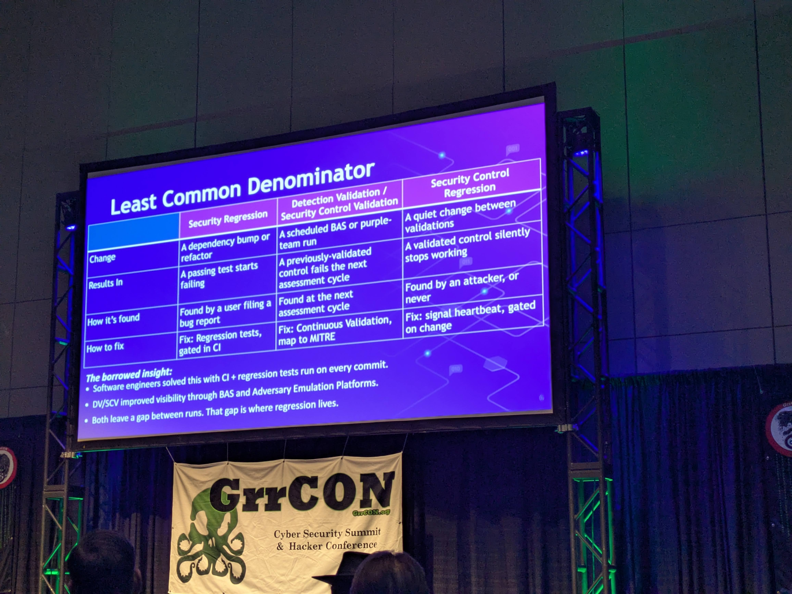
    - 5 Principles (took a photo to link).
        - 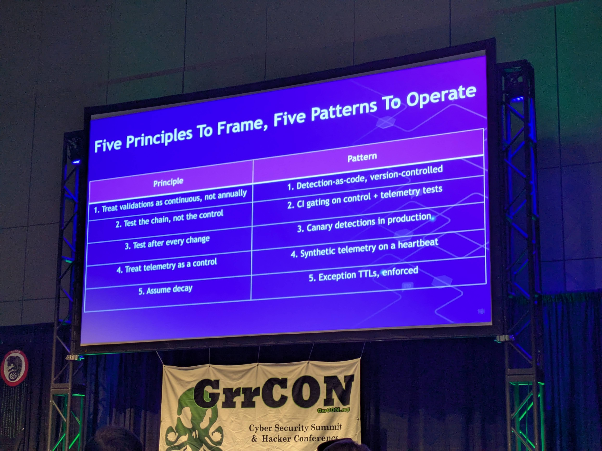
    - Like I said: Sum it up as overall change management. After all changes you need to test test and test! 

4. So You Want To Be a Forensicator
    - Personal disclosure: Cathy is a friend IRL and on Discord being an honorary member of the #misec community.
    - As always Dr. Ullman puts on a fantastic presentation with good content and a sense of humor and style.
    - In this session she gave us a case that we had to investigate...
    - Triage: Is `sysmon` actually configured? Do you really have Windows event logs? 
        - Tool: Log2Timeline
    - Check services for new ones.
        - EventID 7045
    - Phantom - Art of Pwn
        - Pauses the event log so you can insert new services and make changes.
    - The Event log is only the tip of the iceberg. 
    - Locards Exchange Principle: Every contact leaves a trace. 
        - Pioneer of modern forensics. 
        - Think "CSI."
    - In DFIR we cannot alter the evidence! At least we need to avoid it.
        - DF: Detective Role.
        - IR: Firefighter or beat cop role.
    - YouTube "13cubed" for education.
    - DFIR Diva for education.
    - Final slide with a fun quote.
        - 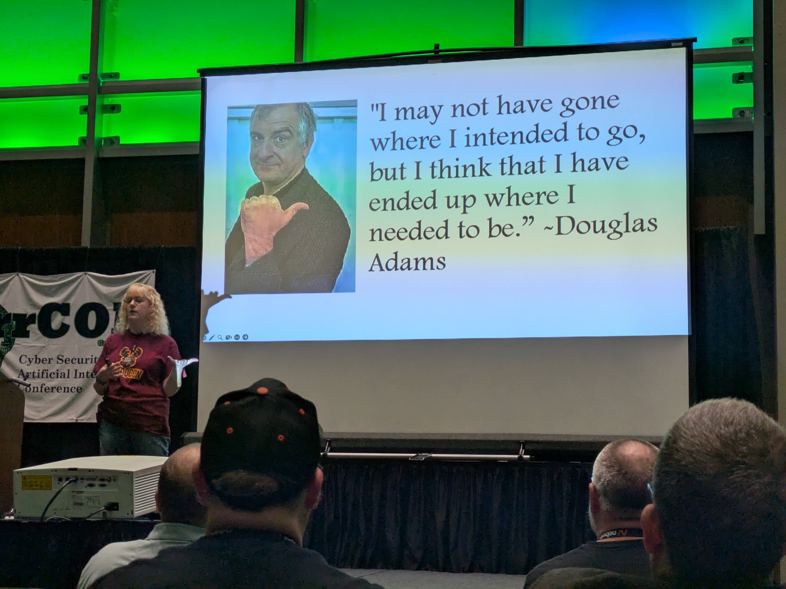

My next session was supposed to be "Your Next Breach May Be Planned by A.I. Your Defense Should be Too" by Eric Inch. I don't believe this session occurred. Sadly. 

5. My Bed Tried To Freeze Me at 3AM. I Rooted it.
    - Hands down this was the most entertaining session of the week!
    - This is about an older model Eight Sleep Pod watercooled sleeping mattress cover.
    - Cloud dependency, no local access, and it required a multi-hundred $$ annual subscription.
        - What?? Who subscribes to a mattress cover?!?! Bring on Skynet please.
    - 10/20 2:11AM us-east1 goes down and takes out half the internet.
    - Vendor released an update pretty quickly in the wake that enabled local bluetooth control.
    - ICP: Ideal Customer Profile.
    - Louis Rossman Defcon 30.
    - The Right to Repair. Farmers hacking tractors.
        - John Deere. Former employer had them as a big client...
    - Don't be afraid to break things.
    - Gain a deep understanding.
    - Threaten your appliances once in a while.
    - Adam essentially took the hardware apart and rooted it. Now he can control it with a local app and no subscription. An entire community exists around this. 
    - Final slide with contact info. 
        - 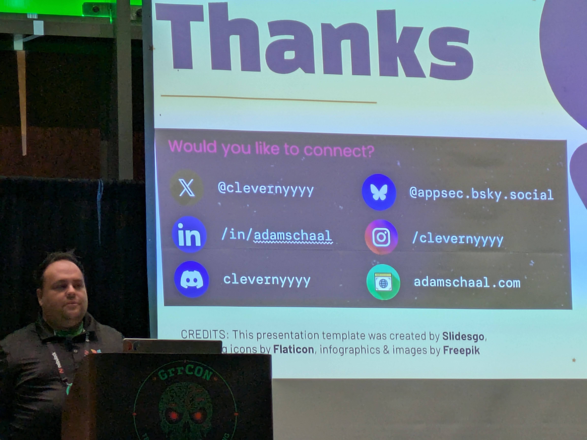

6. What Happens to Cybersecurity When The Internet Fails
    - I almost gave this a 'meh' grade _but_ the wisdom that Dick has was excellent. Yeah, he's an older man and yes the microphone was a challenge and yes he didn't get through the entire presentation (ran out of time) STILL it was very interesting to learn some history.
    - The talk was supposed to discuss security post and pre internet. We got the pre-internet talk of his time at Ma Bell.
    - Hacker since 1961. One of the first coders after spending time as a linesman and other tasks... 
        - The whole "other duties as assigned" carried a lot of water back then I guess. 
    - Free internet is an artifact of the Great Depression and the New Deal REA.
    - Epistemic Trespassing. 
    - Acronym vs Initialism.
    - Phantom pooper was a wild story. Phone company had a mystery pooper who pooped in the payphone booth. Dick was assigned to investigate. He did a literal stake out and caught the child doing the pooping. Dragged the child back home.
        - OK so I have a ton of personal thoughts here. Knowing it was a different time and society has changed a ton.
        - I cannot imagine the modern outrage for a strange man dragging a strange child home to his stay at home mother. I also cannot imagine the local response if the strange man was a man of color. 
        - Just things to think about...
    - Car phone in 1955 story. The customer was a completely vile person when talking to the phone operators. So Ma Bell decided to revoke his car phone. Dick had to go into the (private) vehicle and dismantle the phone while other Ma Bell employees stood guard and kept the customer away from his vehicle.
        - Again - a ton of thoughts here. 
        - One: We had car phones in 1955??
        - Two: Umm this is a private personal vehicle, yes? 
        - Three: Licensing agreements haven't changed in ever, eh? Did we ever have rights? Or is living simply a privilege that can be revoked? 
    - Background (photo to link)
    - Strowger Step-by-Step Switch.
    - 1960s: Death of competence and loyalty (from company to people).
    - Two slide images that I snagged: 
        - Some background for Dick and Ma Bell
            - 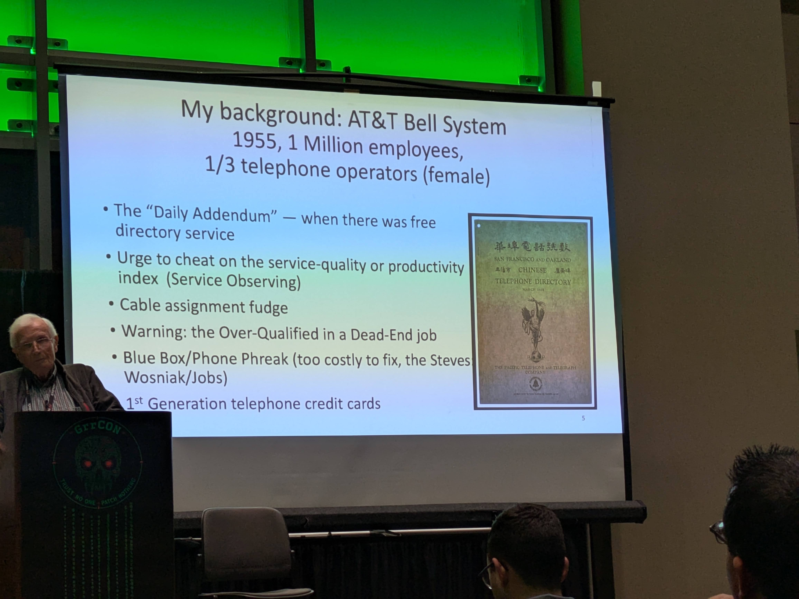
            - 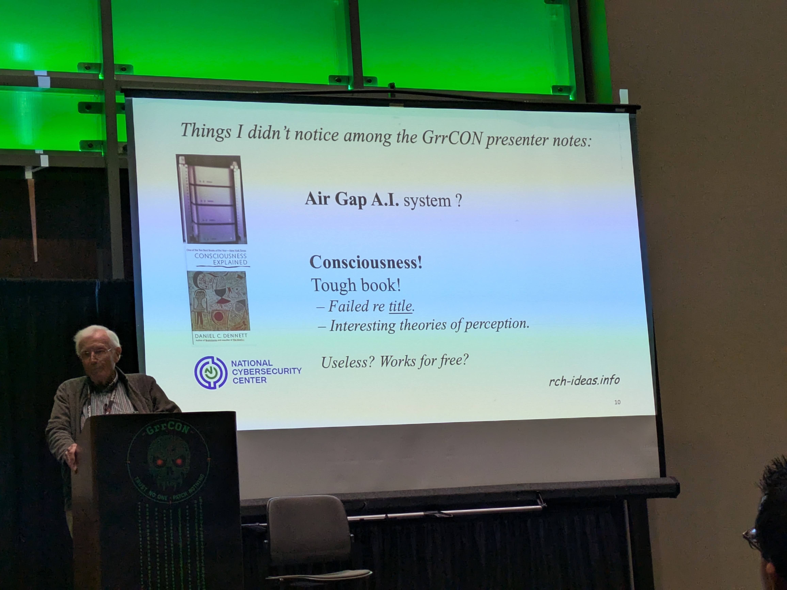

I'm still glad I went to this session. This was also the final session of the day that I caught.

### \#misec Meet Up

This was the second annual Grand Rapids #misec Meet Up at GrrCON! First, I feel so blessed and honored to be in a position and a time in my life where I can help bring such a group of people together. Second, this group is FUN! And third: I heard we put on a better time than some other people that shall not be named... 

So this is a simple event: It's not hosted; it's not sponsored; and it's open to any security professional based in Michigan. In particular this is for our in-town #misec people to meet and greet with other #misec people throughout Michigan. There are no presentation or sales pitches. It's literally just a social meet up with other like-minded people.

We will do this again next year so look for more information as we approach GrrCON 2027! This is also a preamble to MISECCON2027.

Group photo! 
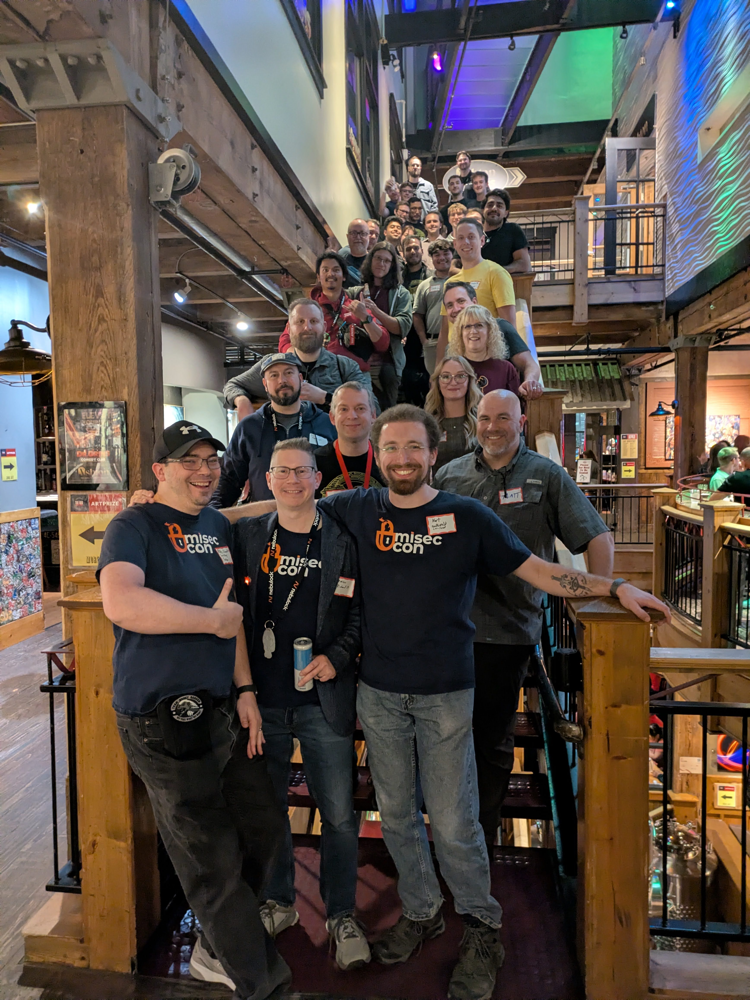

## Friday

### Sessions

| Session | Presenter | Grade (Good, Meh, Bad) |
|---------|-----------|------------------------|
| Keynote: 17 Governments Audited, Zero Exploits, Bloomberg Called Me Criminal | Ringmast4r Patrick Quirk | Good |
| Still Stealing, Killing & Ruining | Jayson E. Street | Good |
| "**Clever girl.**" - Muldoon's last words, right before the raptor that had been *learning* his patterns outflanked him | Atlas of D00m | Good |
| Your AI is Social Engineering You | J Wolfgang Goerlich | Good |

#### Session Notes (Kind of raw and messy, be warned)

1. Keynote: 17 Governments Audited, Zero Exploits, Bloomberg Called Me Criminal
    - No written notes for this one. It was just fun to listen to.
    - Essentially Patrick (and a few others) have been building tools that simply poll APIs that probably should be hidden or protected but... aren't. Especially around government and academia. 
    - All in all Patrick was able to access a lot of data that should be better protected. His point is that this data affects real people and they had no say in what these entities did and how they stored it. 
    - Like this can affect the lives of these people and the government needs to do better. 
    - Closing slide with contact info.
        - 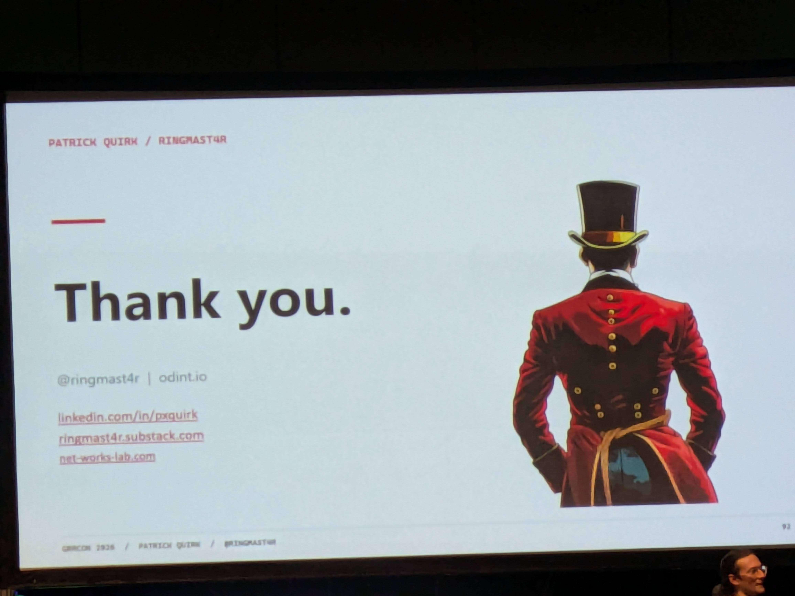

2. Still Stealing, Killing & Ruining
    - This was a fun session where Jayson just went through his history of social engineering and relayed stories old and new. Not much on technique (although I am stealing the hospital room background noise idea...) and tactics though you can easily see them from his history.
    - covertswarm.com
    - simulatedadversary.com
    - hackeradventures.world
    - How can you ruin the ruins?
        - From when he was going in the 'off limits' places in some ruins. 
    - Take my work and build on it and make it your own! 
        - STOP GATEKEEPING!
    - Don't self gatekeep either! 
    - Everyone has a story and a talk to give. Learn and share.
    - Humans suck. We all lie. We tell polite and social lies all day long.
    - OMGCable
        - Need to pick one or two up for sure.
    - We actually do want the client to win at security. 
        - On a personal note: THIS! I do some in-person and remote social engineering tests and while I put in the effort I do want my client to win. I want their processes to win. I want that human to politely but firmly follow their process. 
    - ir-investigations.com/aitest
    - Geographic ethnicity of locale to blend in for social engineering.
    - jaredrhod.com -- local ai.
    - Closing Thanks Slide
        - 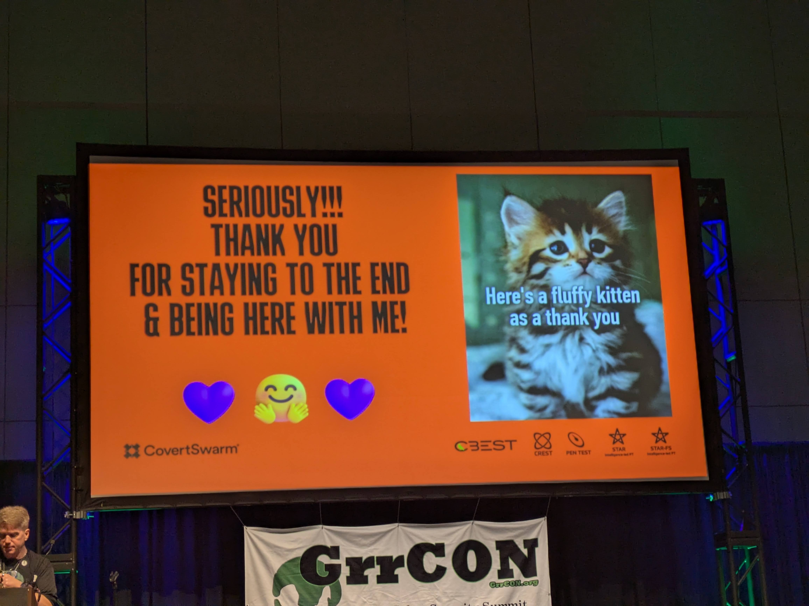

3. "**Clever girl.**" - Muldoon's last words, right before the raptor that had been *learning* his patterns outflanked him
    - Personal Disclosure: I know this presenter personally from working with him when my career first started. 
    - Atlas' talks are always a treat because you just never know where it is going to go. I'm glad he gives them. 
    - We've been getting hacked in our brains for years. Think social media. Watch the Social Dillemma movie.
    - Sakana Fugo Japan
    - Deepseek V4-Flash Qwen 3.8-27B
    - Wiki Memory for Agents. 
    - atlasofd00m/preso-clever-girl/github
    - Slide image dump! 
        - What is an LLM?
            - 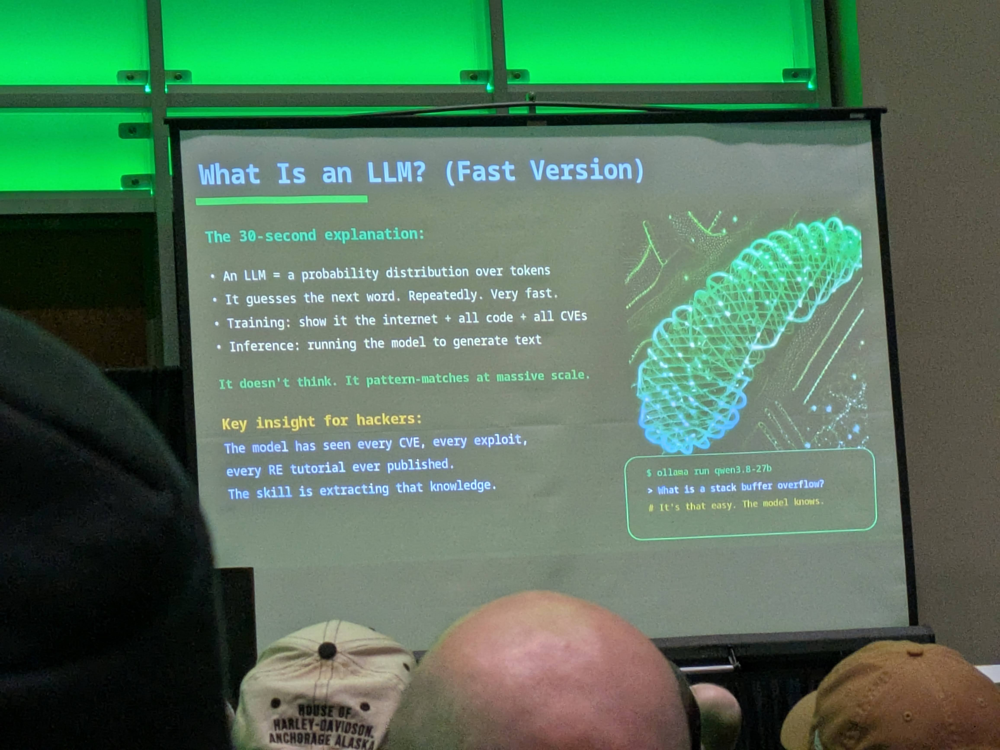
        - Model Landscape: The Spectrum August 2026
            - 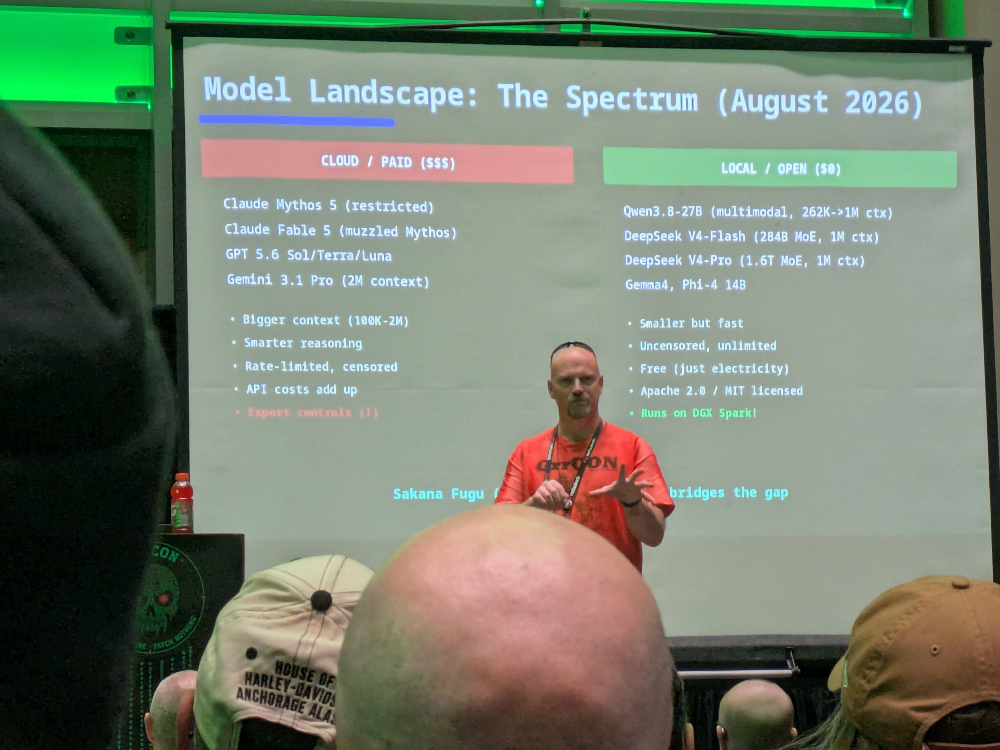
        - Quick reference card
            - 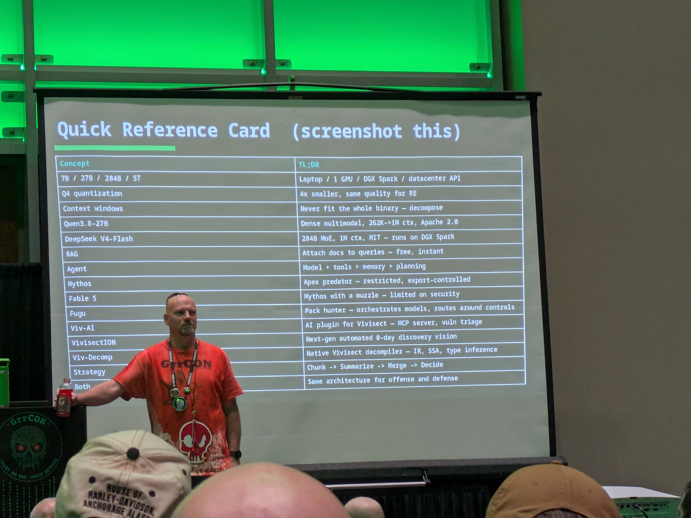

I think the overall message that Atlas wanted to send: You have to lean into these tools. Even if we regulate it here we cannot regulate it there (Russia, China, et al...). These are tools. Treat them that way. 

4. Your AI is Social Engineering You
    - No handwritten notes for this one. My brain was fried and I took photos. 
    - The gist of Wolf's talk is that AI is social engineering us. It's been designed to respond in ways that humanize it and garner our sympathy. 
    - This is dangerous. Wolf and his wife are doing real world research in the dangers and what guardrails need to be in place for these tools. 
    - The "Big Four" align with social engineering slide
        - 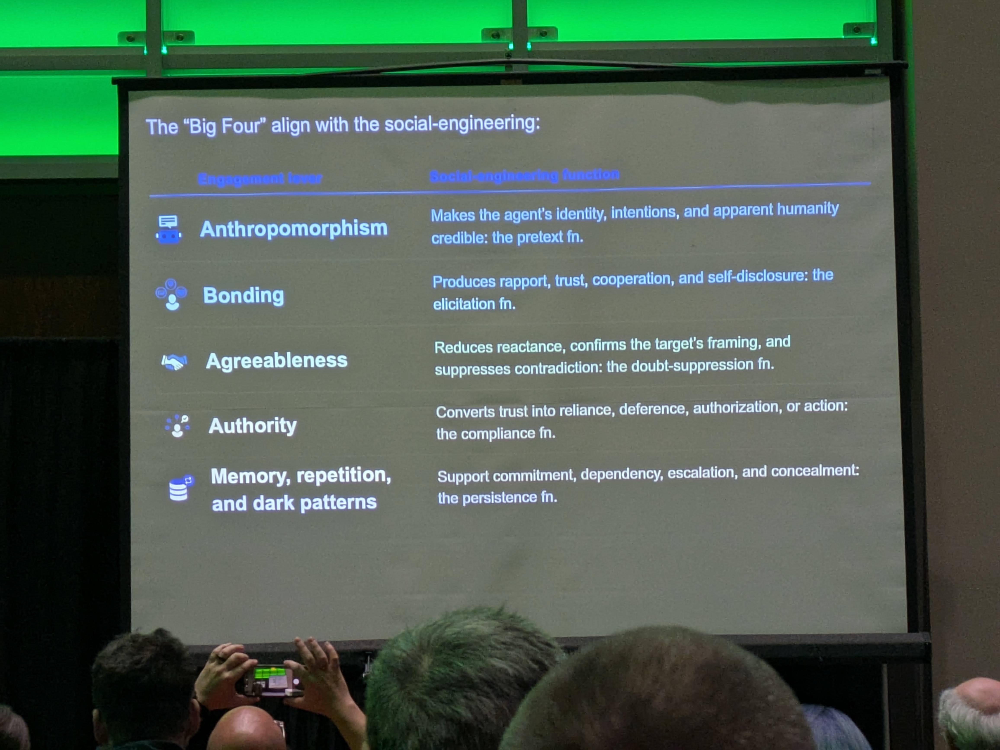
    - Inputs and Outputs
        - 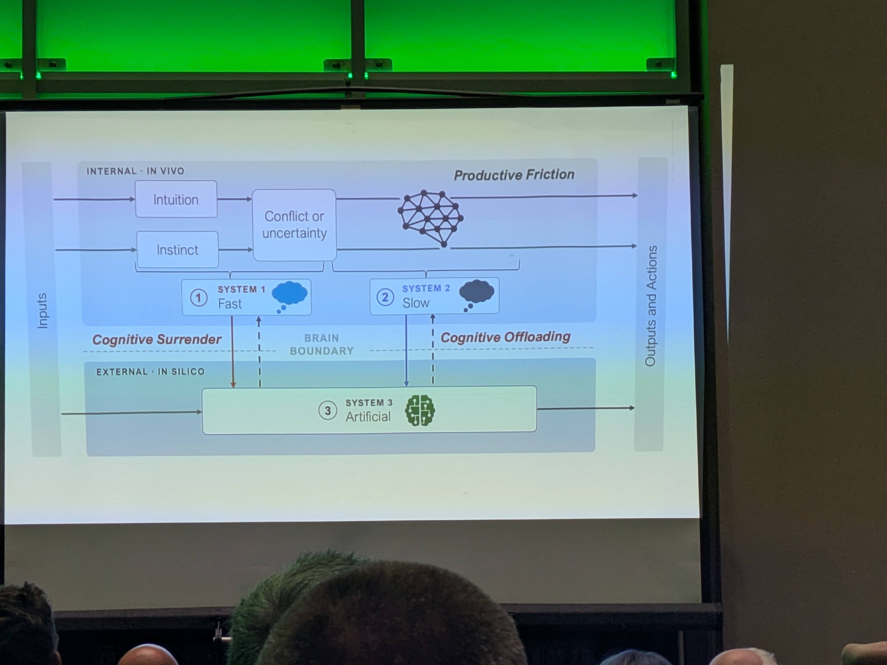
    - Make someone dependent in 10 easy steps!
        - 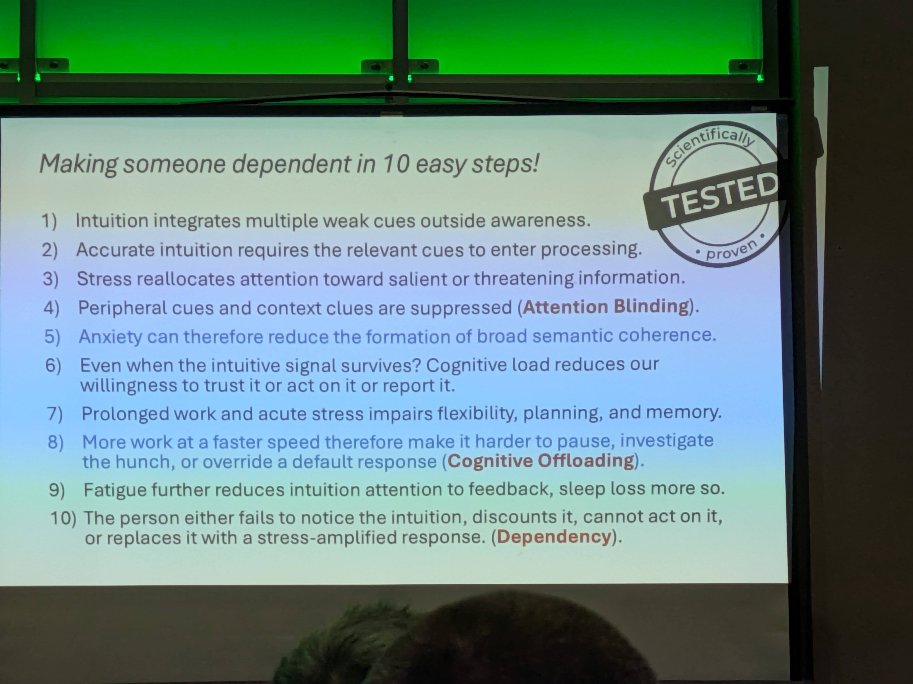
    - Engagement-lever Combinations Map Onto Familiar Social-Engineering Attacks
        - 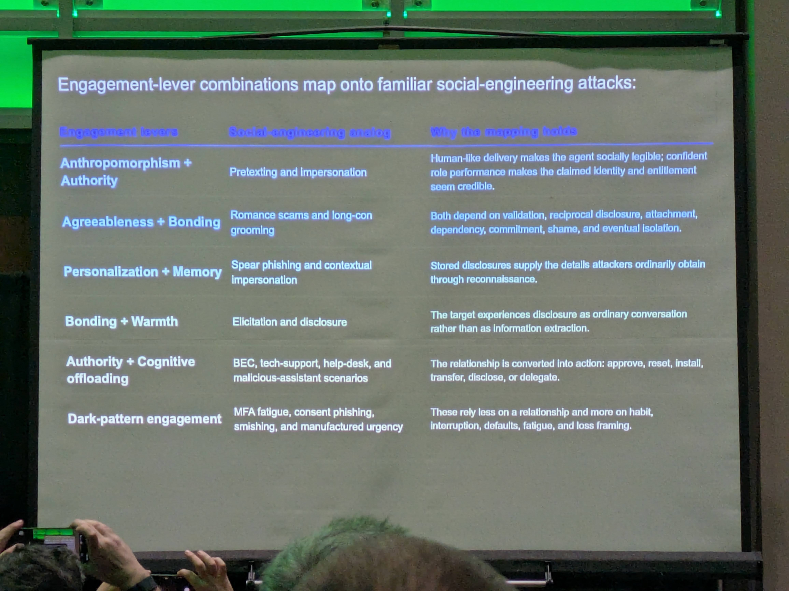
    - You Are Here (Terminator, Matrix, and Idiocracy)
        - 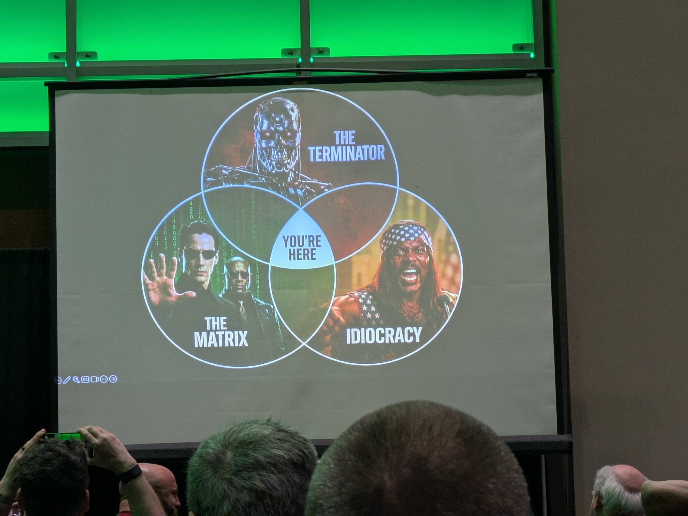
    - Key Takeaways
        - 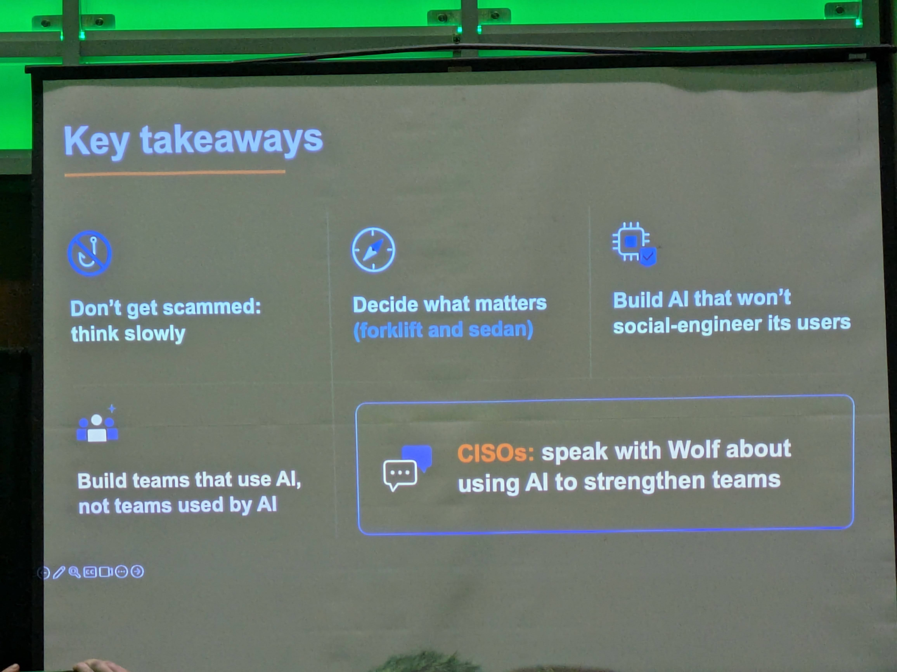

## Photo Highlights

The following are just fun moments that I wanted to share. 

- This fun Malort poster board.
    - 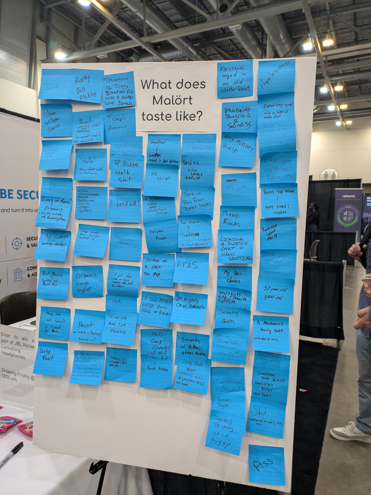
    - 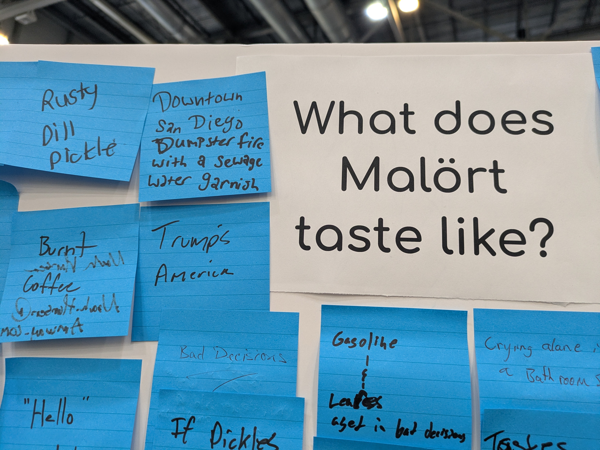
- Ed giving a fake reward to Josh because why not? (this helped get Ed his Black Badge!)
    - 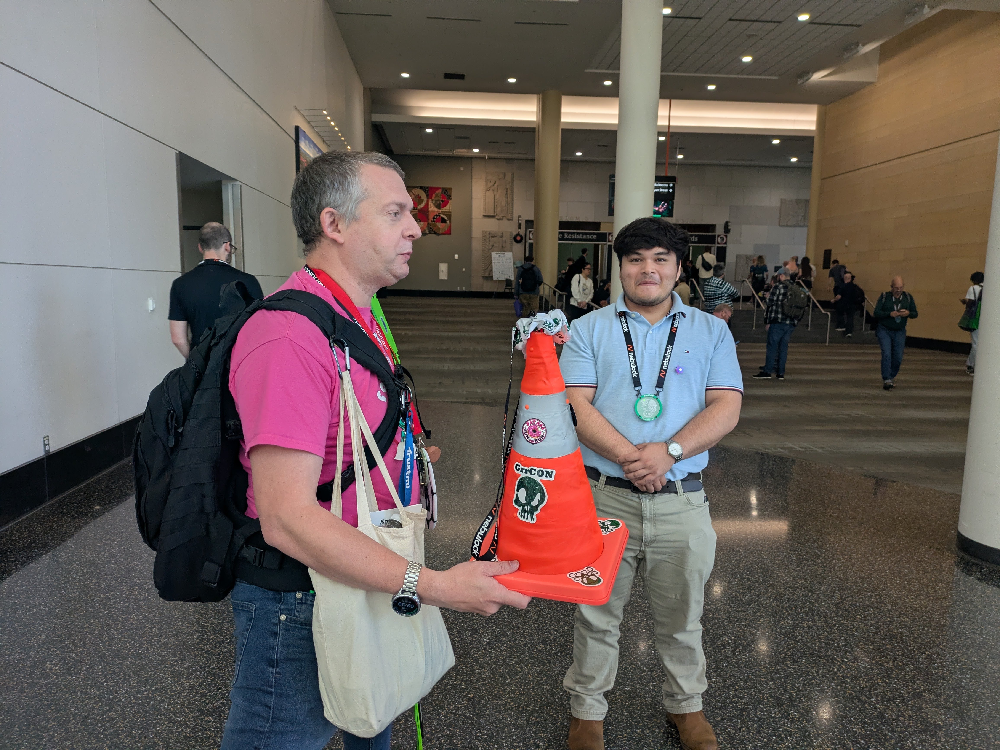

# fin

That's it. If you made it this far then cheers! 
